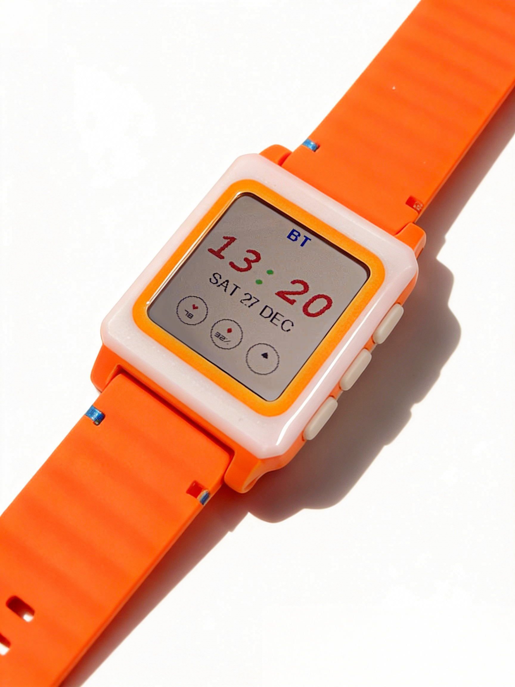
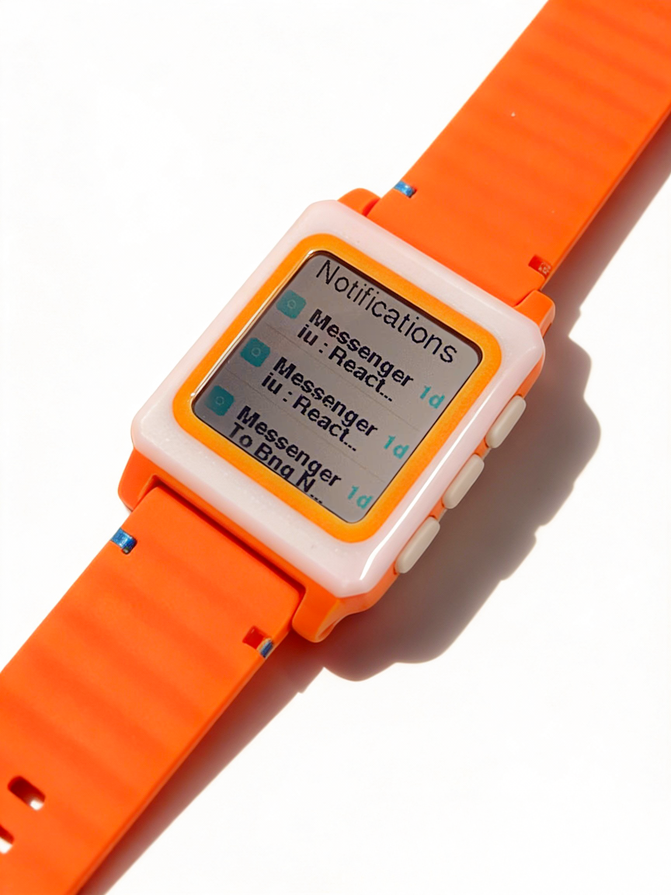
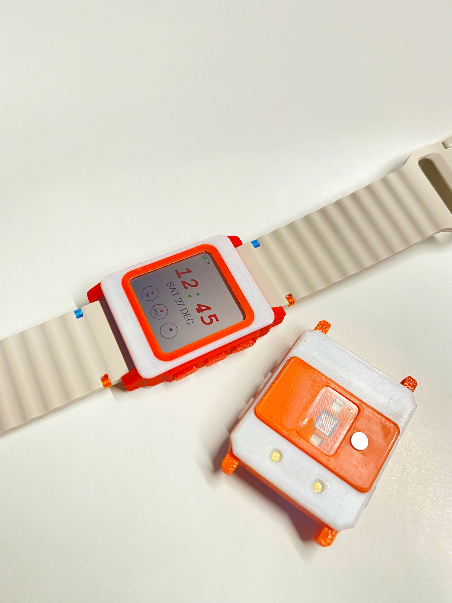
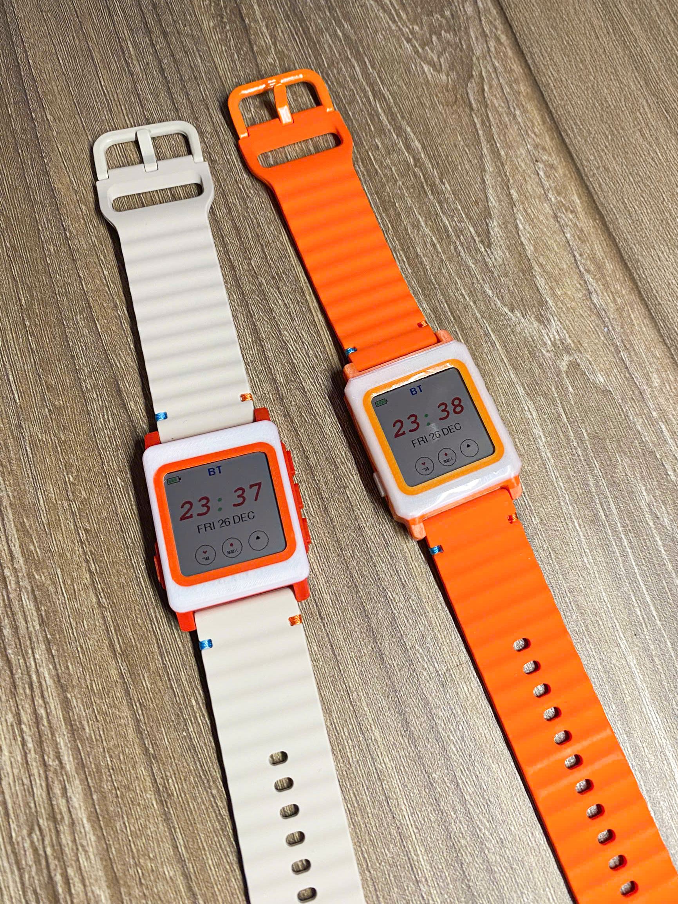
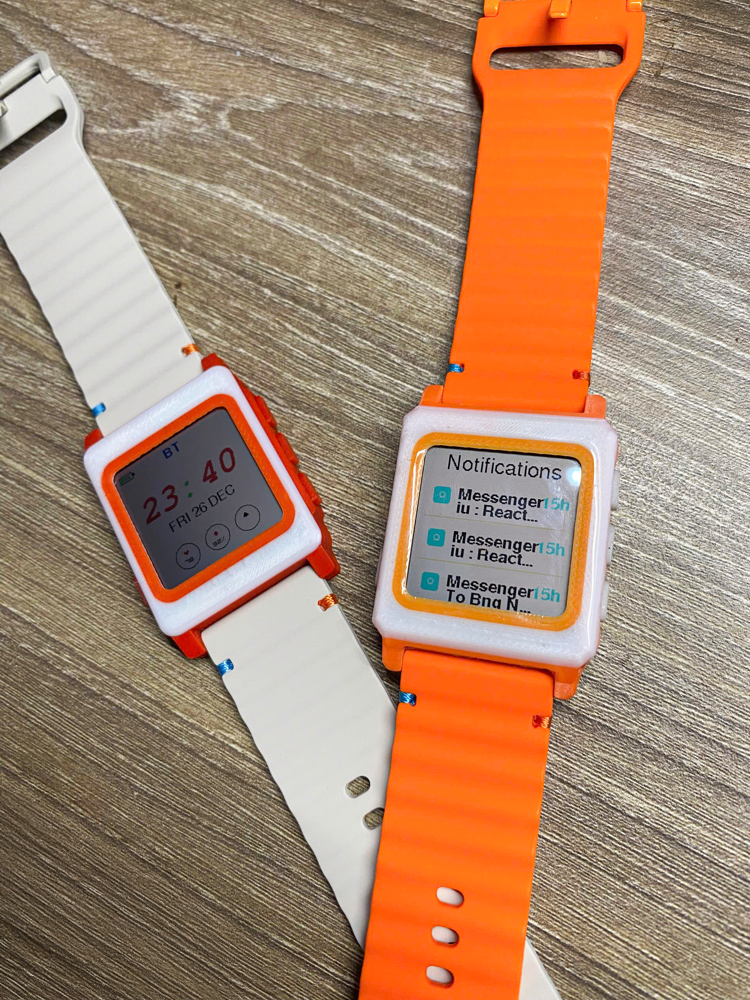
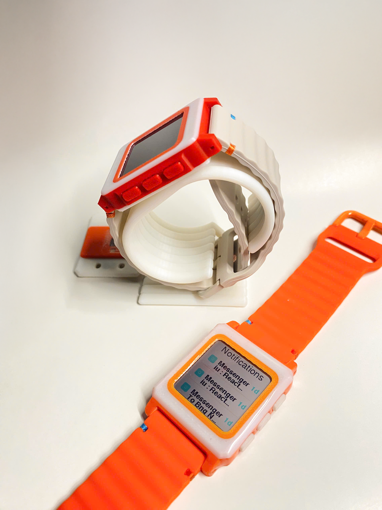
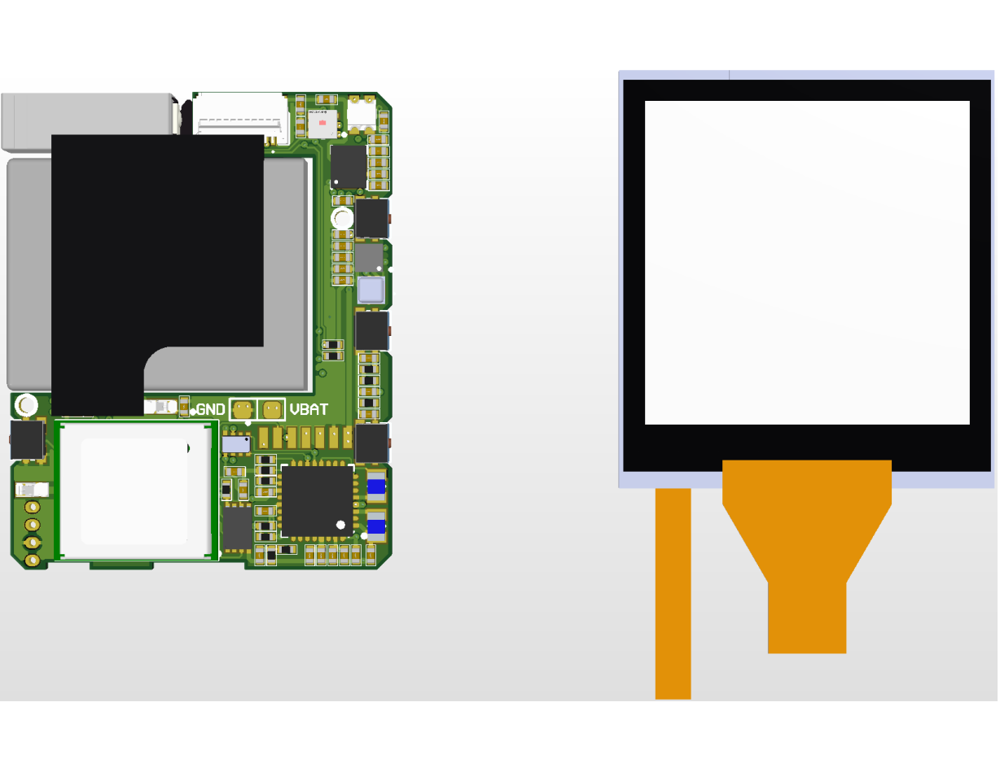
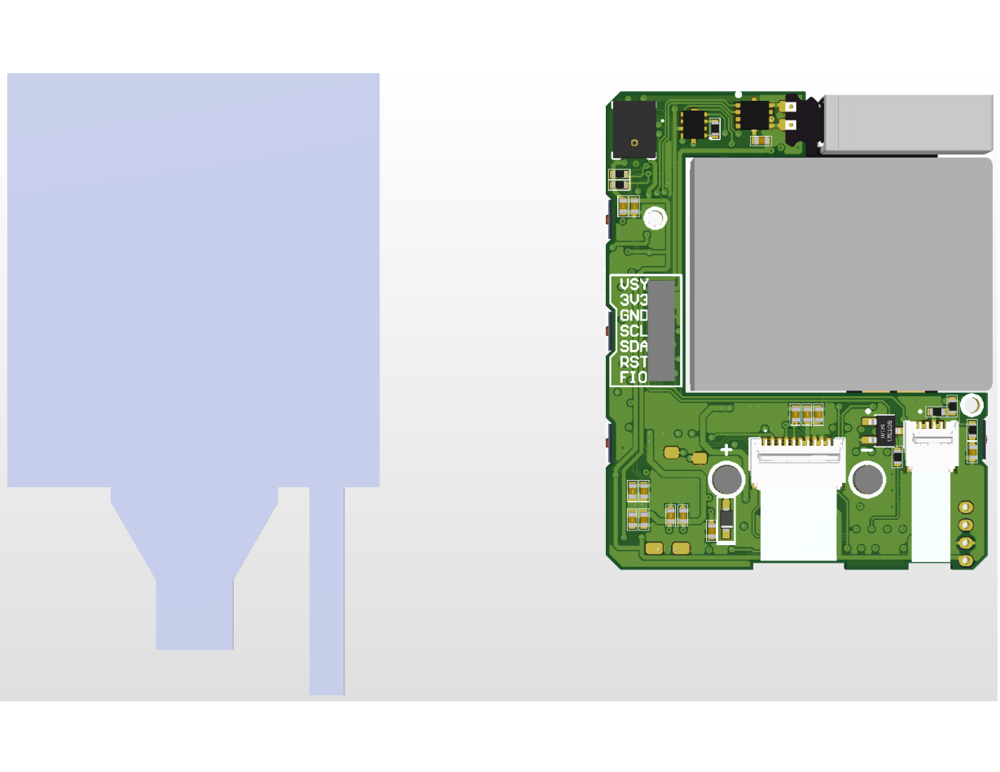

# ✋ KWatch – Open Wearable Dev Kit

   
  <strong>Hackable smartwatch platform: Nordic silicon, Zephyr firmware, open hardware.</strong>

  
  &nbsp;
  

KWatch is a full-stack, open hardware kit to build a wearable that feels production-ready but stays mod-friendly. One PCB set, one Zephyr firmware, one place to script apps and demos quickly.

## Table of Contents
- 🔍 [What this repo delivers](#what-this-repo-delivers)
- 🧭 [Platform at a glance](#platform-at-a-glance)
- ⚙️ [Hardware highlights](#hardware-highlights)
- 🧠 [Firmware snapshot](#firmware-snapshot)
- 🖼️ [Quick gallery – real device](#quick-gallery--real-device)
- 🛠️ [PCB views](#pcb-views)
- 🚦 [Status & roadmap](#status--roadmap)
- 🧭 [Repository map](#repository-map)
- 🚀 [Fast start (Zephyr)](#fast-start-zephyr)
- ✅ [Build/test checklist](#buildtest-checklist)
- 🛠️ [Writing apps](#writing-apps)
- 📜 [Licence](#licence)
- 🙏 [Thanks](#thanks)

## What this repo delivers
- **Fabrication-ready hardware**: KiCad sources and manufacturing files for the watch mainboard, aligned with the photo set and BOM.
- **Zephyr firmware baseline**: BLE, sensors, display, haptics, and power tuned for wearables on nRF52840.
- **App hooks**: An app-manager direction so you can prototype UX without forking the platform.
- **Expectations you can see**: Real-build photos and PCB views to match your assembly to ours.
- **A mod-friendly platform**: Keep experiments fast—swap sensors, iterate watchfaces, ship demos without redoing the core.

## Platform at a glance

| Layer | Highlights |
| --- | --- |
| 🛠️ **Hardware** | nRF52840 mainboard, PMIC, external flash, baro + IMU + magnetometer + ALS, RGB LED, MIP display. |
| 🧠 **Firmware** | Zephyr RTOS, BLE services, gesture wake, low-power policies, haptics, display, app-manager direction. |
| 📱 **App** | Roadmap: companion workflows for sync, OTA, and pushing watch apps. |

## Hardware highlights

- nRF52840 BLE SoC ([u-blox NINA-B301-00B](https://www.u-blox.com/en/product/nina-b30-series-open-cpu-0)): 64 MHz Cortex-M4F, 256 KB RAM, 1 MB flash, ANT/802.15.4/Thread/Zigbee/NFC-A, CryptoCell
- Nordic [nPM1300](https://docs.nordicsemi.com/category/npm1300-category) PMIC for power + system management
- Macronix [W25Q16JVUXIQ TR](https://mm.digikey.com/Volume0/opasdata/d220001/medias/docus/6661/W25Q16JV.pdf) 16 MB external flash
- Bosch [BMP581](https://www.bosch-sensortec.com/products/environmental-sensors/pressure-sensors/bmp581/) barometric sensor (≈20 cm resolution)
- ST [LSM6DSLTR](https://www.st.com/content/ccc/resource/technical/document/datasheet/ee/23/a0/dc/1d/68/45/52/DM00237456.pdf/files/DM00237456.pdf/jcr:content/translations/en.DM00237456.pdf) 6-axis IMU (gestures, lift-to-wake)
- ST [LIS3MDLTR](https://www.st.com/content/ccc/resource/technical/document/datasheet/54/2a/85/76/e3/97/42/18/DM00075867.pdf/files/DM00075867.pdf/jcr:content/translations/en.DM00075867.pdf) magnetometer
- Broadcom [APDS-9306-065](https://docs.broadcom.com/docs/AV02-4755EN) ambient light sensor
- Knowles [SPK0641HT4H-1](https://www.knowles.com/docs/default-source/model-downloads/spk0641ht4h-1-rev-a.pdf) I2S microphone
- Micro Crystal [RV-8263-C8](https://www.microcrystal.com/en/products/real-time-clock-rtc-modules/rv-8263-c8) RTC
- Texas Instruments [ADS1115IRUGR](https://www.ti.com/lit/ds/symlink/ads1115.pdf) 16-bit, 4-channel I²C ADC
- Texas Instruments [DRV2603RUNT](https://www.ti.com/lit/gpn/drv2603) haptic driver for LRA/ERM
- Worldsemi [WS2812B](https://cdn-shop.adafruit.com/datasheets/WS2812B.pdf) addressable RGB LED
- Japan Display [LPM013M126A](https://international.switch-science.com/do/medialibrary/2016/08/LPM013M126A_specification_Ver01_20160720.pdf) 1.28" 176×176 Memory-in-Pixel TFT with custom backlight

## Firmware snapshot

- Zephyr-based project with custom board definition in [firmware/boards](firmware/boards) (K_watch).
- Application lives in [firmware/app](firmware/app); `prj.conf` captures feature toggles and power/peripheral policies.
- Focus: BLE connectivity, low-power idle, gesture-driven wake, haptics, display pipeline, and an app-manager path for user apps.

## Status & roadmap

- **Hardware**: Rev v0.1 validated (see galleries). Next: refine power/PMIC tuning and add strap/closure options.
- **Firmware**: Core bring-up on Zephyr complete; prioritizing display pipeline polish, haptics tuning, and app-manager ABI.
- **Companion app**: Roadmap item—planned for sync, OTA, and app delivery; interim control via BLE scripts.

## Repository map

- [firmware/app](firmware/app): Main application sources and `prj.conf` feature toggles.
- [firmware/boards](firmware/boards): Board definition (K_watch) for Zephyr.
- [hardware](hardware): Schematics, layout, fabrication outputs.
- [production](production): Manufacturing assets and photos.
- [resources](resources): Logos and build photos used in this README.

## Quick gallery — real device

  <table style="border-collapse:collapse;">
    <tr>
      <td align="center" style="padding:8px">
        <figure>
          
          <figcaption><small>Assembly detail</small></figcaption>
        </figure>
      </td>
      <td align="center" style="padding:8px">
        <figure>
          
          <figcaption><small>Build angle</small></figcaption>
        </figure>
      </td>
      <td align="center" style="padding:8px">
        <figure>
          
          <figcaption><small>Component close-up</small></figcaption>
        </figure>
      </td>
    </tr>
    <tr>
      <td align="center" style="padding:8px">
        <figure>
          
          <figcaption><small>Workbench shot</small></figcaption>
        </figure>
      </td>
      <td align="center" style="padding:8px">
        <figure>
          
          <figcaption><small>On-wrist view</small></figcaption>
        </figure>
      </td>
      <td align="center" style="padding:8px">
        <figure>
          
          <figcaption><small>Packaging / kit</small></figcaption>
        </figure>
      </td>
    </tr>
  </table>
  
If images do not render, open them directly from <a href="resources/image">resources/image</a>.

## PCB views

  <table style="width:100%; max-width:980px; border-collapse:collapse;">
    <tr>
      <td align="center" style="padding:12px; width:50%">
        <figure>
          
          <figcaption><small>Top PCB — silkscreen & component placement</small></figcaption>
        </figure>
      </td>
      <td align="center" style="padding:12px; width:50%">
        <figure>
          
          <figcaption><small>Bottom PCB — power plane & connectors</small></figcaption>
        </figure>
      </td>
    </tr>
  </table>

## Fast start (Zephyr)
1) Install Zephyr prerequisites (Python, west, CMake, ARM GCC toolchain or Zephyr SDK). See the Zephyr Getting Started guide for your OS.
2) From repo root, initialize workspace once:
   - `west init -l firmware`
   - `west update`
3) Export CMake package: `west zephyr-export`.
4) Build: `west build -b K_watch firmware/app`
5) Flash via your probe (J-Link/CDC): `west flash`

If you use a non-default toolchain, set `ZEPHYR_TOOLCHAIN_VARIANT` and `GNUARMEMB_TOOLCHAIN_PATH` before building.

## Build/test checklist

- ✅ Configure workspace with `west init -l firmware && west update`.
- ✅ Build: `west build -b K_watch firmware/app`.
- ✅ Flash: `west flash` (probe connected).
- ✅ Smoke test: BLE advertises, display backlight cycles, haptic tick works, IMU responds over shell.
- ⚠️ If power draw is high, review `prj.conf` low-power options and disable unused peripherals.

## Writing apps

- User apps are planned as Zephyr subsys-style modules with a small ABI. For now, keep code in [firmware/app/src](firmware/app/src) and guard features with Kconfig in `prj.conf`.
- Prefer event-driven patterns and avoid long busy loops to keep power low and wake latency tight.

## Licence

This project is licensed under the GNU GPLv3. Compared to permissive licences like MIT, GPLv3 requires that if you modify this code and distribute your version (including in commercial products), you must also release your changes under the same GPLv3 licence and provide the corresponding source code.

This way, everyone can benefit from improvements built on top of this project. If this licence causes issues for your intended use, feel free to contact me – I’m open to discussing alternatives.

## Thanks

Community contributions are welcome: hardware bring-up notes, power traces, UI sketches, test logs, and app experiments all help the project move faster.
