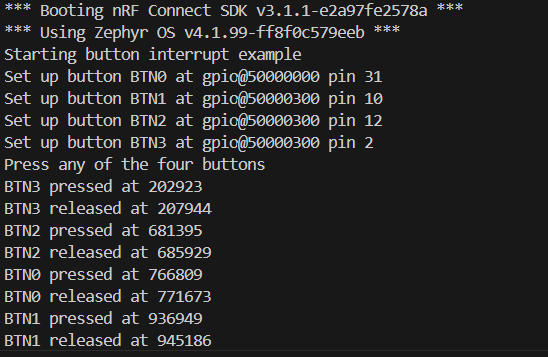

# K_Watch Button — Button Interrupt Example

**Project Overview**
- **What:** A small Zephyr-based firmware example that demonstrates handling four physical buttons with GPIO interrupts.
- **Why:** Shows how to configure button GPIOs, attach edge-triggered interrupts, and log button press/release events with timestamps using Segger RTT.
- **Where to look:** Source is in `src/main.c`. Build entry is `CMakeLists.txt` and runtime configuration is `prj.conf`.

**Features**
- Initialize up to four buttons using devicetree aliases `btn0`..`btn3`.
- Configure interrupts on both edges (press and release).
- Print human-readable events with a timestamp using Zephyr printk (routed to Segger RTT per `prj.conf`).

**Hardware Requirements**
- A board supported by Zephyr that exposes four button aliases (`btn0`..`btn3`) in its devicetree.
- A Segger J-Link (or other supported debugger) for flashing and RTT logging (or adapt to a UART console).

**Build — Prerequisites**
- Install Zephyr SDK and toolchain and follow Zephyr "Getting Started" instructions.
- Ensure `west` (Zephyr meta-tool) is installed and `ZEPHYR_BASE` is set.
- Have a board name that provides `btn0..btn3` aliases. Replace `<board>` below with your board ID.

**Build & Flash (recommended)**
Run these commands from the `firmware/kwatch_button` directory:

```bash
# from project root: firmware/kwatch_button
west build -b <board> -s . -d build
west flash
```

If you prefer CMake + Ninja directly:

```bash
mkdir -p build
cd build
cmake -DBOARD=<board> ..
cmake --build .
cmake --build . --target flash
```

**Run & Observe**
- The firmware routes logging to Segger RTT by default (see `prj.conf`). Use Segger RTT Viewer, `JLinkRTTClient`, or `west debug` with an RTT-capable debugger to view log output.
- On boot you should see lines like:

```
Starting button interrupt example
Set up button BTN0 at GPIO_0 pin 13
Set up button BTN1 at GPIO_1 pin 5
Press any of the four buttons
```

- When pressing or releasing a button you will see events such as:

```
BTN0 pressed at 123456
BTN0 released at 123789
```

**Implementation details**
- `src/main.c` registers a `gpio_callback` per button and configures `GPIO_INT_EDGE_BOTH` so both press and release produce events.
- Timestamps are printed using `k_cycle_get_32()`; convert to milliseconds if you need wall-clock time.

**Troubleshooting**
- If you see errors about missing device nodes: verify the board's devicetree defines `btn0`..`btn3` aliases. You may need to add or adapt aliases in the board DTS.
- If no logs appear: confirm the debugger/RTT connection and check `prj.conf` settings (`CONFIG_USE_SEGGER_RTT`, `CONFIG_RTT_CONSOLE`, `CONFIG_LOG_BACKEND_RTT`).
- If a GPIO device is not ready, ensure the board support package supports the GPIO controller used by the button pins.

**Files of interest**
- `src/main.c` — core example implementation.
- `CMakeLists.txt` — Zephyr project build integration.
- `prj.conf` — runtime configuration and logging backend.
- `README.md` — this file.

**Next steps / Ideas**
- Add debouncing logic or report long-press / double-press gestures.
- Publish sample device tree overlay for your target board to guarantee `btn0..btn3` aliases.

---
If you'd like, I can: 1) adapt this README to include your board name and exact devicetree snippets, or 2) commit the file and run a local build (if your environment is configured). Which would you prefer?

**Device Output (example)**

The screenshot below shows a sample boot log and button events captured via Segger RTT from a device running this firmware. Save the attached screenshot to `assets/button_output.png` to display it inline here.



Transcribed output from the screenshot:

```
*** Booting nRF Connect SDK v3.1.1-e2a97fe2578a ***
*** Using Zephyr OS v4.1.99-ff8f0c579eeb ***
Starting button interrupt example
Set up button BTN0 at gpio@50000000 pin 31
Set up button BTN1 at gpio@50000300 pin 10
Set up button BTN2 at gpio@50000300 pin 12
Set up button BTN3 at gpio@50000300 pin 2
Press any of the four buttons
BTN3 pressed at 202923
BTN3 released at 207944
BTN2 pressed at 681395
BTN2 released at 685929
BTN0 pressed at 766809
BTN0 released at 771673
BTN1 pressed at 936949
BTN1 released at 945186
```

If you want, I can add the actual screenshot file into `assets/button_output.png` in the repository now (I have the attachment you provided). Should I write it into the repo? 
