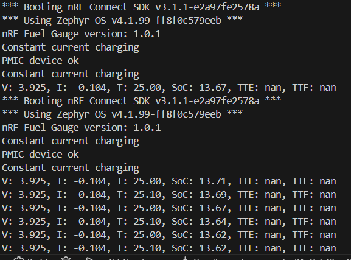

# kwatch_npm_fuel_gause

A Zephyr sample application that integrates an nPM13xx PMIC with the nRF Fuel Gauge library to monitor battery state: voltage, current, temperature, charge status and estimated SoC / TTE / TTF.

## Highlights
- Initializes and uses `nrf_fuel_gauge` with an embedded battery model.
- Reads PMIC/charger sensors (V, I, T, charge state) and feeds updates to the fuel-gauge engine.
- Prints concise periodic logs (default 1s) showing SoC, TTE and TTF for easy debugging and monitoring.

## Requirements
- A working Zephyr development environment (SDK and toolchain).
- Target board that supports nPM13xx (npm1300 / npm1304) with proper devicetree nodes.
- Build tools: `west` or CMake/Ninja.

## Key Files
- Source: `src/main.c`
- Fuel-gauge wrapper: `src/fuel_gauge.c`
- Public header: `src/fuel_gauge.h`
- Battery model: `src/GRP451621_25C.inc`
- Module CMake: `src/CMakeLists.txt`

## Quick Start — Build & Flash

Using `west` (if the project is managed by west):
```bash
west build -b <board_name> -s . -d build
west flash
```

Or using CMake/Ninja directly:
```bash
mkdir -p build
cd build
cmake -DBOARD=<board_name> -S .. -B .
ninja -C .
# Flash depending on the board/tool, e.g.:
ninja -C . flash
```

Replace `<board_name>` with your target board name.

## Run & Verify
- Connect a serial terminal (e.g. 115200 8N1) or RTT to observe logs.
- The application prints PMIC and fuel-gauge status every second by default.

Example output:
```
PMIC device ok
V: 3.700 V, I: -12 mA, T: 25.0 C, SoC: 85.4 %, TTE: 02:00:00, TTF: 01:00:00
```

Note: many drivers represent discharge current as negative — the code adapts readings before passing them to `nrf_fuel_gauge`.

## Result
Below is the project result image you provided. Place the image file `Result_with_PMIC.png` next to this `README.md` (project root) or update the path below if the file lives elsewhere.



Short caption: Terminal output showing PMIC readings and fuel-gauge estimates (SoC / TTE / TTF).

## Troubleshooting & Notes
- Ensure your devicetree contains the PMIC/charger node (for example `npm1300_pmic`).
- Check `device_is_ready()` for both PMIC and charger before attempting reads.
- If sensors return no data: verify I2C/SPI wiring, devicetree configuration, and kernel/driver logs.

## Next steps I can help with
- I can commit this README change for you.
- If `Result_with_PMIC.png` is located in a different folder (e.g. `docs/` or `assets/`), tell me the path and I'll update the link.
- I can also add a short build-and-run script or CI snippet to automate builds.

If you want me to commit the updated README and add the image to the repository, tell me to proceed.
