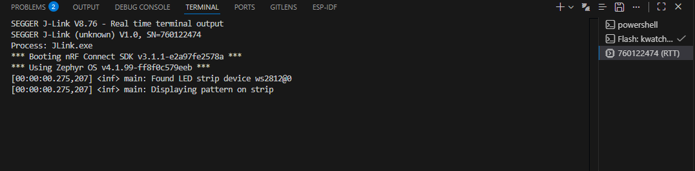

# K_Watch WS2812 LED

> Minimal, professional Zephyr example for driving WS2812 LED strips.



## Summary

This repository contains a compact Zephyr application that demonstrates controlling a WS2812 LED strip. The firmware lights a single moving pixel and cycles through primary colors (red → green → blue). It is intended as a reliable validation and demo example to verify wiring, DeviceTree configuration, and driver operation on Zephyr-supported boards.

## Highlights

- Small, focused demo with clear logging and predictable behavior.
- Uses Zephyr's `led_strip` API and reads `chain_length` from the DeviceTree alias `led_strip`.
- Easy to adapt: change colors, timings, or update strategy for larger strips.

## Requirements

- Zephyr SDK and toolchain installed and configured (see Zephyr documentation).
- `west` or CMake/Ninja build tools.
- A Zephyr-supported target board with the appropriate interface for the LED strip (SPI, PWM, or timing-bitbang depending on driver).
- WS2812 LED strip (or any strip supported by the configured `led_strip` driver).

## Project Structure

- `src/main.c` — Main application implementing the moving-pixel pattern.
- `CMakeLists.txt` — Project build entry.
- `prj.conf` — Project configuration.
- `Result.png` — Runtime screenshot (embedded in this README).

## Quick Start — Build & Flash

Using `west` (recommended):

```bash
west build -b <board_name> -s . -d build
west flash
```

Using CMake/Ninja directly:

```bash
mkdir -p build
cd build
cmake -DBOARD=<board_name> -S .. -B .
ninja -C .
# To flash: ninja -C . flash (or use your board's flashing tool)
```

Replace `<board_name>` with your target board name.

## Run & Verify

- Attach a serial console (e.g. 115200 8N1) or RTT to observe logs.
- On startup the application logs device discovery and then begins the moving-pixel pattern. The default update interval is 1 second (`DELAY_TIME K_MSEC(1000)`).

Example output:

```
*** Booting nRF Connect SDK v3.1.1-e2a97fe2578a ***
*** Using Zephyr OS v4.1.99-... ***
[00:00:00.275,207] <inf> main: Found LED strip device ws2812@0
[00:00:00.275,207] <inf> main: Displaying pattern on strip
```

## Result


*Caption: Terminal output showing the firmware detected the WS2812 device and started the moving-pixel pattern.*

## Troubleshooting & Notes

- DeviceTree: Ensure your board overlay defines an alias named `led_strip` and that the strip node includes a `chain_length` property.
- Wiring & power: Verify the data line, common ground with the board, and that the strip is powered at the correct voltage with appropriate level shifting if required.
- Driver selection: Depending on your board, WS2812 support may be via SPI, PWM, or a timing (bit-banged) driver. Confirm which driver the board supports.
- `device_is_ready()`: If the device is not ready, confirm the DeviceTree node and driver are enabled and that the underlying bus (SPI/I2C/GPIO) is available.
- Performance: The current implementation clears and updates the entire pixel buffer each step. For long strips or limited bus bandwidth, prefer partial updates of only changed pixels if supported by your driver.

## Contributing

Contributions are welcome. Open an issue or submit a pull request for board overlays, wiring diagrams, improved demos, or optimizations.

## License

The project follows the SPDX license header in `src/main.c` (Apache-2.0). See the source file header for author and copyright details.

---

If you want, I can now:
- Commit this README update for you.
- Add a sample `prj.overlay` to define the `led_strip` alias for your board (please provide the board name).
- Add badges, a wiring diagram, or a short GIF demo.
